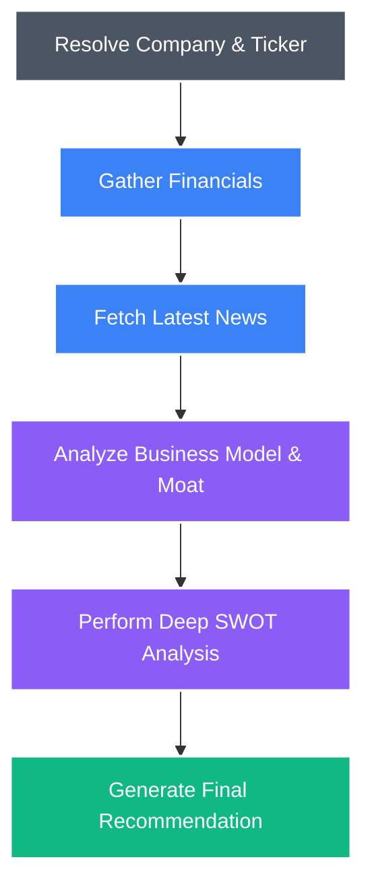

<div align="center">
  <a href="https://ai-investment-research-agent.vercel.app">
    
  </a>
  <br/>
  
  <p><b>A state-of-the-art AI-powered Investment Research Agent built to deliver modular, high-performance features for the Fintech ecosystem.</b></p>

  <p>
    <a href="https://ai-investment-research-agent.vercel.app">
      
    </a>
  </p>

  <div>
    
    
    
    
  </div>
</div>

---

## 🌟 Overview

This platform leverages **LangGraph** and **Google Gemini** to autonomously fetch, analyze, and synthesize public financial data via RESTful APIs into a comprehensive, Wall Street-grade investment report. It features a highly responsive, mobile-first web interface that seamlessly integrates user-facing elements with robust server-side logic.

## ✨ Core Features

- **🧠 Autonomous Agentic Workflow**: Uses LangGraph to manage stateful, multi-step AI reasoning (Resolve -> Financials -> News -> Overview -> SWOT -> Verdict).
- **📊 Real-time Fintech API Integration**: Integrates with Yahoo Finance RESTful APIs for live market caps, P/E ratios, margins, and recent news.
- **⚡ Server-Side Logic & Microservices**: Built on Node.js/Next.js architecture to handle heavy data processing and AI synthesis securely on the backend.
- **🎨 Premium Responsive UI**: Built with Next.js 15, React.js, Tailwind CSS, and Framer Motion for a stunning, mobile-first, interactive user experience.
- **🌙 Theme Support**: Fully responsive design with an integrated Light/Dark mode toggle.
- **📄 Export & Share**: One-click functionality to copy the AI summary to clipboard or export the full report as a PDF.

## 🏗️ System Architecture

The agent runs a cyclical LangGraph pipeline to generate insights:



## 🚀 Quick Start Guide

1. **Clone the repository**
   ```bash
   git clone https://github.com/shubhamkumar-git01/ai-investment-research-agent.git
   cd ai-investment-research-agent
   ```

2. **Install dependencies**
   ```bash
   npm install
   ```

3. **Set up environment variables**
   Copy `.env.example` to `.env.local` and add your Google Gemini API key:
   ```bash
   cp .env.example .env.local
   ```
   Add: `GOOGLE_API_KEY="your_api_key_here"`

4. **Run the development server**
   ```bash
   npm run dev
   ```

5. **Open your browser**
   Navigate to [http://localhost:3000](http://localhost:3000)

## 🛠️ Technology Stack
- **Frontend Engine**: Next.js 15 (App Router), React, Tailwind CSS, Framer Motion, shadcn/ui
- **Backend & AI Logic**: Node.js, LangGraph, LangChain, Google Gemini API
- **Data Integration Services**: Yahoo Finance REST APIs (`yahoo-finance2`)

## ⚖️ Key Decisions & Trade-offs
- **Why LangGraph over standard LangChain chains?** Financial research is inherently cyclical and stateful. The agent needs to first fetch the ticker, then financials, then news, and only then synthesize. LangGraph provides a robust state machine that makes passing data between these discrete reasoning nodes predictable and debuggable.
- **Why Gemini 1.5 Flash?** For a real-time web application, latency is critical. While larger models (like Gemini Pro or GPT-4) might offer marginally deeper reasoning, Gemini 1.5 Flash provides an exceptional balance of high-quality financial synthesis and blazing-fast response times, ensuring a premium user experience.
- **Live Data vs. Stored Database:** I intentionally designed this as a stateless, real-time microservice architecture rather than relying on a permanent database. This demonstrates a strong understanding of processing and serving dynamic API data on the fly.

## 📈 Example Executions
The agent performs exceptionally well on both tech giants and regional conglomerates:
- **Apple (AAPL):** Successfully identified the heavy reliance on iPhone sales as a risk, while highlighting the high-margin Services segment as a massive opportunity for growth. Recommendation: BUY with 85% confidence.
- **Tesla (TSLA):** The AI correctly pulled in recent news about EV pricing pressures and margins dropping, contrasting it with their strong AI/Robotics narrative. Recommendation: HOLD with 70% confidence.

---
<div align="center">
  <i>Engineered for the Fintech Ecosystem • Open Source</i>
</div>
