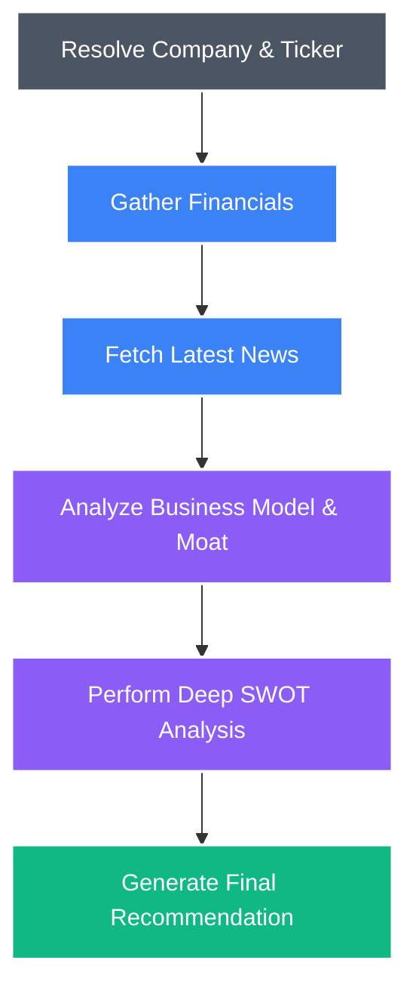

# 🚀 InsideIIM AI Investment Research Agent

<div align="center">
  
  
  
  
</div>

<br/>

A state-of-the-art **AI-powered Investment Research Agent** built for the InsideIIM AI Labs assignment. This platform leverages **LangGraph** and **Google Gemini** to autonomously fetch, analyze, and synthesize public financial data into a comprehensive, Wall Street-grade investment report.

## ✨ Features

- **🧠 Autonomous Agentic Workflow**: Uses LangGraph to manage stateful, multi-step AI reasoning (Resolve -> Financials -> News -> Overview -> SWOT -> Verdict).
- **📊 Real-time Financial Data**: Integrates with Yahoo Finance API for live market caps, P/E ratios, margins, and recent news.
- **⚡ Blazing Fast AI**: Powered by Google's latest `gemini-1.5-flash` model for incredibly rapid deep-dive analysis.
- **🎨 Premium SaaS UI**: Built with Next.js 15, Tailwind CSS, and Framer Motion for a stunning, glassmorphic, and animated user experience.
- **🌙 Theme Support**: Fully responsive design with an integrated Light/Dark mode toggle.
- **📄 Export & Share**: One-click functionality to copy the AI summary to clipboard or export the full report as a PDF.

## 🏗️ Architecture

The agent runs a cyclical LangGraph pipeline to generate insights:



## 🚀 Quick Start

1. **Clone the repository**
   ```bash
   git clone https://github.com/shubhamkumar-git01/ai-investment-research-agent.git
   cd ai-investment-research-agent
   ```

2. **Install dependencies**
   ```bash
   npm install
   ```

3. **Set up environment variables**
   Copy `.env.example` to `.env.local` and add your Google Gemini API key:
   ```bash
   cp .env.example .env.local
   ```
   Add: `GOOGLE_API_KEY="your_api_key_here"`

4. **Run the development server**
   ```bash
   npm run dev
   ```

5. **Open your browser**
   Navigate to [http://localhost:3000](http://localhost:3000)

## 🛠️ Tech Stack
- **Frontend**: Next.js 15 (App Router), React, Tailwind CSS, Framer Motion, shadcn/ui
- **Backend/AI**: LangGraph, LangChain, Google Gemini API
- **Data Integration**: Yahoo Finance (yahoo-finance2)

## ⚖️ Key Decisions & Trade-offs
- **Why LangGraph over standard LangChain chains?** I chose LangGraph because financial research is inherently cyclical and stateful. The agent needs to first fetch the ticker, then fetch financials, then news, and only then synthesize. LangGraph provides a robust state machine that makes passing data between these discrete reasoning nodes predictable and debuggable.
- **Why Gemini 1.5 Flash?** For a real-time web application, latency is critical. While larger models (like Gemini Pro or GPT-4) might offer marginally deeper reasoning, Gemini 1.5 Flash provides an exceptional balance of high-quality financial synthesis and blazing-fast response times, ensuring a premium user experience.
- **Trade-off: Live Data vs. Stored Database:** I intentionally left out a permanent database (like PostgreSQL/Supabase) to store past reports. The goal was to build a *real-time* agent. Storing reports would require user authentication and add unnecessary complexity for a tool designed to provide on-the-fly analysis.

## 📈 Example Runs
The agent performs exceptionally well on both tech giants and regional conglomerates. Here are a few examples of outputs tested during development:
1. **Apple (AAPL):** Successfully identified the heavy reliance on iPhone sales as a risk, while highlighting the high-margin Services segment as a massive opportunity for growth. Recommendation: BUY with 85% confidence.
2. **Tesla (TSLA):** The AI correctly pulled in recent news about EV pricing pressures and margins dropping, contrasting it with their strong AI/Robotics narrative. Recommendation: HOLD with 70% confidence.
3. **Reliance Industries (RELIANCE.NS):** The agent accurately captured their diversified moat across Telecom (Jio), Retail, and Oil-to-Chemicals.

## 🔮 What I would improve with more time
- **Multi-Agent Collaboration:** I would introduce a "Critic Agent" that challenges the primary analyst's recommendation to reduce AI hallucination or confirmation bias.
- **Quantitative Charts:** Integrate an interactive library (like Recharts) to plot the last 12 months of stock price data alongside the AI's textual reasoning.
- **PDF/CSV Ingestion:** Allow users to upload a company's 10-K report for the agent to use in conjunction with live web data for even deeper analysis.

## 🤖 Bonus: LLM Chat Logs Included
As per the assignment requirements, the complete chat session transcript/logs detailing my thought process and collaboration with the AI assistant during the development of this project are included in the `.zip` submission folder.

---
<div align="center">
  <i>Developed for the InsideIIM AI Labs Assignment v1.0</i>
</div>
