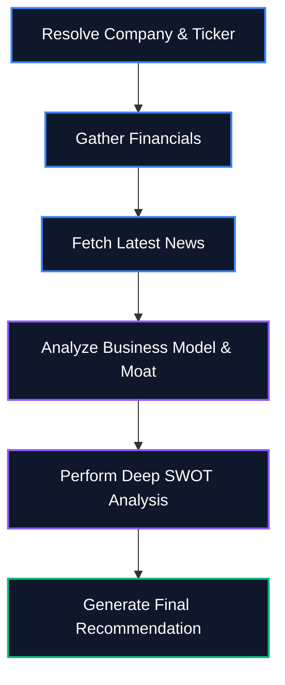

<div align="center">
  <a href="https://ai-investment-research-agent-amber.vercel.app/">
    
  </a>
  <br/>
  
  <p><b>A state-of-the-art AI-powered Investment Research Agent built to deliver modular, high-performance features for the Fintech ecosystem.</b></p>

  <p>
    <a href="https://ai-investment-research-agent-amber.vercel.app/">
      
    </a>
  </p>

  <div>
    
    
    
    
  </div>
</div>

---

## 🌟 Overview

**AI Investment Research Agent** is a cutting-edge Fintech web application that transforms unstructured finance prompts into structured, Wall Street-grade insight cards in seconds. 

It leverages **LangGraph** and **Google Gemini** to autonomously fetch, analyze, and synthesize public financial data via RESTful APIs. Designed with a highly responsive, dark-mode first UI, it seamlessly integrates user-facing elements with robust Node.js server-side logic.

<div align="center">
  <i>"Run a lightweight research workflow that converts unstructured finance prompts into structured insight cards you can scan in seconds."</i>
</div>

---

## ✨ Core Features & Fintech Capabilities

- **🧠 Autonomous Agentic Workflow**: Uses LangGraph to manage stateful, multi-step AI reasoning (Resolve -> Financials -> News -> Overview -> SWOT -> Verdict).
- **📊 Real-time Fintech API Integration**: Integrates with Yahoo Finance RESTful APIs for live market caps, P/E ratios, margins, and recent news.
- **⚡ Server-Side Logic & Microservices**: Built on Node.js/Next.js architecture to handle heavy data processing and AI synthesis securely on the backend.
- **🎨 Premium Responsive UI**: Built with Next.js 15, React.js, Tailwind CSS, and Framer Motion. 

## 💎 User Experience & Visual Design

- **Cinematic Dark Mode**: Features a sleek, modern dark-themed interface optimized for long reading sessions and professional financial analysis.
- **Micro-animations & Fluidity**: Utilizes Framer Motion for staggered list reveals, smooth layout transitions, and interactive hover states that make the application feel alive.
- **Skeleton Loaders & State Management**: Implements polished skeleton loading states during API fetch and AI synthesis phases, ensuring the user is always aware of the agent's progress.
- **Responsive Layout**: 100% mobile-first design ensuring Wall Street-grade research is readable on any device without compromising on data density.
- **📄 Structured Insight Cards**: Automatically formats complex financial analysis into easy-to-read Summary, Risks, Sentiment, and Actionable Angle cards.

## 🏗️ System Architecture

The agent runs a cyclical LangGraph pipeline to generate insights:



## 🚀 Quick Start Guide

1. **Clone the repository**
   ```bash
   git clone https://github.com/shubhamkumar-git01/ai-investment-research-agent.git
   cd ai-investment-research-agent
   ```

2. **Install dependencies**
   ```bash
   npm install
   ```

3. **Set up environment variables**
   Copy `.env.example` to `.env.local` and add your Google Gemini API key:
   ```bash
   cp .env.example .env.local
   ```
   Add: `GOOGLE_API_KEY="your_api_key_here"`

4. **Run the development server**
   ```bash
   npm run dev
   ```

5. **Open your browser**
   Navigate to [http://localhost:3000](http://localhost:3000)

## 🛠️ Technology Stack
- **Frontend Engine**: Next.js 15 (App Router), React, Tailwind CSS, Framer Motion, shadcn/ui
- **Backend & AI Logic**: Node.js, LangGraph, LangChain, Google Gemini API
- **Data Integration Services**: Yahoo Finance REST APIs (`yahoo-finance2`)

## ⚖️ Key Decisions & Trade-offs
- **Why LangGraph over standard LangChain chains?** Financial research is inherently cyclical and stateful. The agent needs to first fetch the ticker, then financials, then news, and only then synthesize. LangGraph provides a robust state machine that makes passing data between these discrete reasoning nodes predictable and debuggable.
- **Why Gemini 1.5 Flash?** For a real-time web application, latency is critical. While larger models might offer marginally deeper reasoning, Gemini 1.5 Flash provides an exceptional balance of high-quality financial synthesis and blazing-fast response times, ensuring a premium user experience.

---
<div align="center">
  <i>Engineered for the Fintech Ecosystem • Open Source</i>
</div>
